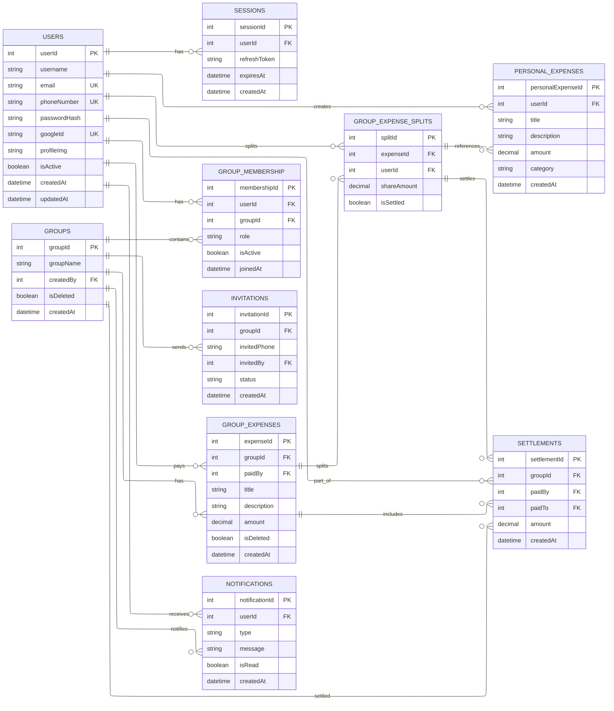

# SpliX — Peer-to-Peer Expense Splitter

A graph-algorithm-powered expense splitting platform that minimizes the number of transactions required to settle group debts.

---

## 1. Problem Statement

### Problem Title

Inefficient Peer-to-Peer Expense Settlement in Group Finances

### Problem Description

Most expense-sharing tools calculate who owes what but don't optimize _how_ those debts are settled. This leads to unnecessary transaction chains, debt loops, and settlement confusion in everyday group finance scenarios.

### Target Users

- Flatmates splitting rent and utilities
- Travel groups dividing trip costs
- Friend groups managing shared events
- Colleagues handling team expenses

### Existing Gaps

- No graph-based optimization to minimize transactions
- Debt loops among participants are never collapsed
- No visual representation of the debt network
- No support for recurring expenses or partial payments
- Inconsistent handling of currency rounding

---

## 2. Problem Understanding & Approach

### Root Cause Analysis

The inefficiency comes from treating settlement as a balance sheet problem rather than a graph optimization problem. In a group of 6 people, a naive approach can generate up to 15 transactions. The same state can be resolved in as few as 5 using the Minimum Cash Flow algorithm.

### Solution Strategy

1. Model group debts as a **weighted directed graph** — nodes are people, edges are debts
2. Apply the **MCF algorithm** to collapse the graph into the minimum number of transactions
3. Visualize the debt graph **before and after optimization** using D3.js
4. Automate recurring expenses via a background job queue
5. Track partial payments and handle rounding at the data layer

---

## 3. Proposed Solution

### Solution Overview

SpliX is a full-stack web app where groups log shared expenses, view balances, and settle all debts in the minimum possible number of transactions — powered by a graph optimization algorithm.

### Core Idea

> "Every other tool tells you what you owe. SpliX tells you the minimum number of payments to make it all go away."

### Key Features

- **Expense Logging** — Add expenses with payer, amount, category, and split type
- **Flexible Splitting** — Equal, percentage, exact amounts, or custom shares
- **Settlement Optimizer** — MCF algorithm generates the minimum transaction set
- **Debt Graph Visualization** — D3.js force-directed graphs showing before/after
- **Savings Counter** — Displays how many transactions were eliminated
- **Recurring Expenses** — Auto-repeat daily/weekly/monthly expenses
- **Partial Payments** — Mark settlements as partially or fully completed
- **Analytics Dashboard** — Spending by category, timeline, per-person breakdown
- **Group Management** — Create groups, invite by email or link

---

## 4. System Architecture

### High-Level Flow

```
User → React Frontend → Express API → Service Layer → MCF Algorithm → Prisma ORM → PostgreSQL
```

### Architecture Description

- **Frontend** — React + TypeScript, React Query for data fetching, React Flow for graph visualization, Zustand for global state, shadcnui
- **API Layer** — Express.js with JWT auth middleware and Zod validation on all routes
- **Service Layer** — Business logic including the MCF optimizer, split calculator, and graph builder
- **Data Layer** — Prisma ORM → PostgreSQL for persistence;

### Architecture Diagram

```

┌─────────────────────────────────────────────────────────────────────────┐
│                         CLIENT LAYER                                    │
│   React 18 + TypeScript + Vite                                          │
│   ├── React Router v6        → Page routing                             │
│   ├── Zustand                → Global state (user, groups, expenses)    │
│   ├── React Query            → Server state, caching, loading states    │
│   ├── Axios                  → HTTP client with auth interceptors       │
│   ├── D3.js                  → Debt graph force-directed visualization  │
│   ├── Recharts               → Analytics charts (pie, bar, line)        │
│   ├── shadcn/ui + Tailwind   → UI components + styling                  │
│   └── React Hook Form + Zod  → Form handling + validation               │
└──────────────────────────────┬──────────────────────────────────────────┘
                               │  HTTPS / REST API
┌──────────────────────────────▼──────────────────────────────────────────┐
│                         API LAYER                                       │
│   Node.js 20 LTS + Express.js + TypeScript                              │
│   ├── Auth Middleware         → JWT verification on every request       │
│   ├── Zod Middleware          → Request body validation                 │
│   ├── Rate Limiter            → express-rate-limit (Redis backed)       │
│   └── Error Handler           → Centralized error formatting            │
└──────────────────────────────┬──────────────────────────────────────────┘
                               │
┌──────────────────────────────▼──────────────────────────────────────────┐
│                       SERVICE LAYER                                     │
│   optimizer.service.ts  →  ★ MCF Algorithm (Minimum Cash Flow)          │
│   expense.service.ts    →  Create, split, categorize expenses           │
│   balance.service.ts    →  Compute net balances across group            │
│   recurring.service.ts  →  Clone expenses on schedule                   │
│   graph.service.ts      →  Build node/edge data for Graphs              │
└──────────┬──────────────────────────────────────────────────────────────┘
           │                                        
┌──────────▼────────────────┐       
│      DATA LAYER           │       
│  Prisma ORM               │       
│  └── PostgreSQL 15        │       
│      ├── Users            │       
│      ├── Groups           │                                           
│      ├── GroupMembers     │       
│      ├── Expenses         │       
│      ├── ExpenseSplits    │       
│      ├── Settlements      │       
│      └── Snapshots (JSONB)│       
└───────────────────────────┘

```

---

## 5. Database Design

### ER Diagram

> _(Add ER diagram image here)_

### ER Diagram Description

7 core tables:



| Table                 | Purpose                                         |
| --------------------- | ----------------------------------------------- |
| `Users`               | Account credentials and preferences             |
| `Groups`              | Shared expense context with base currency       |
| `GroupMembers`        | Junction table tracking role (admin/member)     |
| `Expenses`            | Shared purchases with split type and recurrence |
| `ExpenseSplits`       | Per-person owed amount for each expense         |
| `Settlements`         | Optimized payment instructions                  |
| `SettlementSnapshots` | Before/after graph state stored as JSONB        |

---

## 6. Dataset Selected

> Not applicable. All data is user-generated at runtime — expenses, group compositions, and payment histories form the live financial graph the algorithm operates on.

---

## 7. Model Selected

### Model Name

**Minimum Cash Flow (MCF) Algorithm** — greedy graph optimization

### Selection Reasoning

Mathematically proven to produce the minimum number of transactions for any group debt state. Implemented in ~50 lines of pure TypeScript with no external library. Runs in O(n log n) — imperceptible latency for groups up to 100 members.

### Alternatives Considered

| Approach           | Reason Rejected                                        |
| ------------------ | ------------------------------------------------------ |
| Naive debt listing | Generates up to n(n-1)/2 transactions; no optimization |
| Debt chaining      | Only handles simple cycles                             |
| Linear programming | Overkill; too slow for real-time use                   |
| NetworkX           | Python-only                                            |
| JS graph libraries | Unnecessary — MCF only needs sorted arrays             |

### Evaluation Metrics

| Metric                  | Description                                           |
| ----------------------- | ----------------------------------------------------- |
| Transaction Reduction % | `(before − after) / before × 100`                     |
| Correctness             | Sum of settlements = sum of all positive net balances |
| Balance Closure         | Every member's net balance = 0 after settlement       |

---

## 8. Technology Stack

### Frontend

| Technology               | Purpose                                     |
| ------------------------ | ------------------------------------------- |
| React 18 + TypeScript    | UI framework                                |
| Vite                     | Build tool and dev server                   |
| Tailwind CSS + shadcn/ui | Styling and components                      |
| D3.js                    | Force-directed debt graph visualization     |
| Recharts                 | Analytics charts                            |
| Zustand                  | Global state management                     |
| React Query              | Server state, caching, loading/error states |
| React Router v6          | Client-side routing                         |
| React Hook Form + Zod    | Form handling and validation                |
| Axios                    | HTTP client                                 |

### Backend

| Technology                  | Purpose                                     |
| --------------------------- | ------------------------------------------- |
| Node.js 20 LTS + Express.js | Server runtime and web framework            |
| TypeScript                  | Type safety                                 |
| Zod                         | Request validation middleware               |
| JWT + bcrypt                | Authentication and password hashing         |
| BullMQ                      | Background job queue for recurring expenses |
| ioredis                     | Redis client                                |
| Socket.io _(optional)_      | Real-time expense notifications             |

### ML / AI

> Not applicable. Core intelligence is the **MCF graph optimization algorithm** in pure TypeScript.

### Database

| Technology    | Purpose                          |
| ------------- | -------------------------------- |
| PostgreSQL 15 | Primary relational database      |
| Prisma ORM    | Type-safe queries and migrations |

### Deployment

| Service | Purpose              |
| ------- | -------------------- |
| Vercel  | Frontend hosting     |
| Render  | Backend + PostgreSQL |

---

## 9. API Documentation & Testing

### API Endpoints List

**Auth**

- `POST /api/auth/register` — Create account
- `POST /api/auth/login` — Authenticate, receive JWT
- `GET  /api/auth/me` — Get current user profile

**Groups**

- `GET  /api/groups` — List user's groups
- `POST /api/groups` — Create new group
- `GET  /api/groups/:id` — Group details and members
- `POST /api/groups/:id/invite` — Add member by email
- `GET  /api/groups/:id/balances` — Net balance per member

**Expenses**

- `GET    /api/groups/:id/expenses` — Paginated expense list
- `POST   /api/groups/:id/expenses` — Add expense with auto-split
- `PUT    /api/expenses/:id` — Edit expense
- `DELETE /api/expenses/:id` — Delete expense

**Settlements**

- `GET  /api/groups/:id/settle/optimize` — Run MCF; returns before/after graph + transactions
- `POST /api/groups/:id/settle/confirm` — Save settlement plan and snapshot
- `PUT  /api/settlements/:id/complete` — Mark payment as done
- `GET  /api/groups/:id/settle/history` — Past snapshots with savings stats

**Analytics**

- `GET /api/groups/:id/analytics` — Spending breakdown by category, timeline, per-person

### API Testing Screenshots

---

## 10. Module-wise Development & Deliverables

### Checkpoint 1: Research & Planning

- Deliverables: Tech stack decisions, system architecture, Prisma schema, API contracts, 24-hour build timeline

### Checkpoint 2: Backend Development

- Deliverables: Prisma migrations, JWT auth, Groups + Expenses CRUD, MCF algorithm, settlement endpoints, Zod validation middleware

### Checkpoint 3: Frontend Development

- Deliverables: React scaffold, auth pages, dashboard, groups page, expense form (all split types), D3 settlement optimizer page, Recharts analytics, Zustand stores, React Query hooks

### Checkpoint 4: Model Training

> Not applicable.

### Checkpoint 5: Model Integration

- Deliverables: MCF algorithm wired to optimize endpoint, graph JSON sent to React Flow, before/after animation, transaction savings badge, snapshot persistence

### Checkpoint 6: Deployment

- Deliverables: , Vercel + Render deploy, environment variables, demo seed script, README, demo video

---

## 11. End-to-End Workflow

1. User registers and logs in via JWT authentication
2. User creates a group and invites members by email
3. Members log expenses — who paid, how much, and how to split
4. Dashboard shows each member's live net balance
5. User clicks "Optimize" — MCF algorithm runs and returns minimum transaction set
6. Graphs animate the before/after debt simplification with savings count
7. Members follow step-by-step payment instructions and mark each as complete

---

## 12. Demo & Video

- **Live Demo:**
- **Demo Video:**
- **GitHub Repo:**

---

## 13. Hackathon Deliverables Summary

- Full-stack web application with auth, groups, and expense management
- MCF algorithm minimizing settlement transactions in pure TypeScript
- React Flow interactive debt graph with before/after optimization visualization
- Four split types: equal, percentage, exact, and custom shares
- Complete REST API with 15+ endpoints, JWT auth, and Zod validation
- PostgreSQL + Prisma with 7 relational tables
- Deployed production application on Vercel + Render

---

## 14. Team Roles & Responsibilities

| Member Name        | Role               | Responsibilities                                   |
| ------------------ | ------------------ | -------------------------------------------------- |
| Amanjeet           | Full-Stack Lead    | Architecture, MCF algorithm, settlement API        |
| Shubhi Kumari      | Frontend Developer | React pages, React Flow graphs, Recharts analytics |
| Ayush Kumar Pandey | Backend Developer  | Express routes, Prisma schema, auth                |

---

## 15. Future Scope & Scalability

### Short-Term

- Email / push notifications on new expenses or settlements
- Google OAuth login
- Multi-currency settlement with live exchange rates
- Expense receipt photo upload

### Long-Term

- UPI payment gateway to trigger real payments
- Mobile app (React Native) on the same API
- Bank statement parsing via OCR for auto-import
- Enterprise plan with approval workflows and audit logs
- AI-powered spending insights and budget recommendations
- CSV export of group history

---

## 16. Known Limitations

- MCF does not account for user preferences (e.g., avoiding transactions with specific people)
- Multi-currency support depends on a third-party exchange rate API
- Real-time sync is optional — members may see stale balances without refresh
- No offline support; requires an active internet connection
- Graph rendering optimized for groups up to 50 members

---

## 17. Impact

- Reduces financial friction for flatmates, travel groups, and teams by minimizing coordination effort
- Eliminates unnecessary transactions — a group of 8 could drop from 28 settlements to 7
- Improves financial transparency through visual debt graphs, reducing disputes
- Demonstrates a practical real-world application of graph optimization algorithms
- Potential to expand into a full personal finance platform with budgeting and insights
